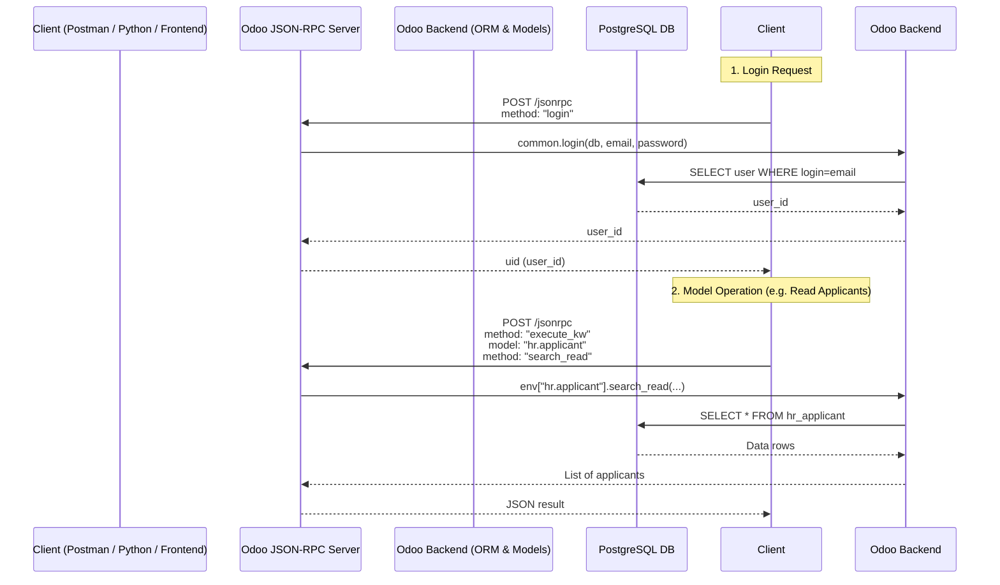

# Odoo

[](https://runbot.odoo.com/runbot)
[](https://www.odoo.com/documentation/master)
[](https://www.odoo.com/forum/help-1)
[](https://nightly.odoo.com/)

Odoo is a suite of web based open source business apps.

The main Odoo Apps include an [Open Source CRM](https://www.odoo.com/page/crm),
[Website Builder](https://www.odoo.com/app/website),
[eCommerce](https://www.odoo.com/app/ecommerce),
[Warehouse Management](https://www.odoo.com/app/inventory),
[Project Management](https://www.odoo.com/app/project),
[Billing &amp; Accounting](https://www.odoo.com/app/accounting),
[Point of Sale](https://www.odoo.com/app/point-of-sale-shop),
[Human Resources](https://www.odoo.com/app/employees),
[Marketing](https://www.odoo.com/app/social-marketing),
[Manufacturing](https://www.odoo.com/app/manufacturing),
[...](https://www.odoo.com/)

Odoo Apps can be used as stand-alone applications, but they also integrate seamlessly so you get
a full-featured [Open Source ERP](https://www.odoo.com) when you install several Apps.

## Getting started with Odoo

For a standard installation please follow the [Setup instructions](https://www.odoo.com/documentation/master/administration/install/install.html)
from the documentation.

To learn the software, we recommend the [Odoo eLearning](https://www.odoo.com/slides),
or [Scale-up, the business game](https://www.odoo.com/page/scale-up-business-game).
Developers can start with [the developer tutorials](https://www.odoo.com/documentation/master/developer/howtos.html).

## Security

If you believe you have found a security issue, check our [Responsible Disclosure page](https://www.odoo.com/security-report)
for details and get in touch with us via email.



## Project Structure (Folders Only)

```bash
odoo/
├── .tx/
├── .vscode/
├── addons/
│   ├── attachment_indexation/
│   │   ├── i18n/
│   │   ├── models/
│   │   └── tests/
│   │       └── files/
│   ├── auth_signup/
│   │   ├── controllers/
│   │   ├── data/
│   │   ├── i18n/
│   │   ├── models/
│   │   ├── static/
│   │   │   └── src/
│   │   ├── tests/
│   │   └── views/
│   ├── auth_totp/
│   │   ├── controllers/
│   │   ├── data/
│   │   ├── i18n/
│   │   ├── models/
│   │   ├── security/
│   │   ├── static/
│   │   │   ├── src/
│   │   │   └── tests/
│   │   ├── tests/
│   │   ├── views/
│   │   └── wizard/
│   ├── auth_totp_mail/
│   │   ├── data/
│   │   ├── i18n/
│   │   ├── models/
│   │   ├── static/
│   │   │   └── tests/
│   │   ├── tests/
│   │   └── views/
│   ├── auth_totp_portal/
│   │   ├── i18n/
│   │   ├── models/
│   │   ├── security/
│   │   ├── static/
│   │   │   ├── src/
│   │   │   └── tests/
│   │   ├── tests/
│   │   └── views/
│   ├── base_import/
│   │   ├── controllers/
│   │   ├── i18n/
│   │   ├── models/
│   │   ├── security/
│   │   └── static/
│   │       ├── csv/
│   │       ├── src/
│   │       └── tests/
│   ├── base_import_module/
│   │   ├── controllers/
│   │   ├── i18n/
│   │   ├── models/
│   │   ├── security/
│   │   ├── static/
│   │   │   └── src/
│   │   ├── tests/
│   │   ├── views/
│   │   └── wizard/
│   ├── base_install_request/
│   │   ├── data/
│   │   ├── i18n/
│   │   ├── models/
│   │   ├── security/
│   │   ├── views/
│   │   └── wizard/
│   ├── base_setup/
│   │   ├── controllers/
│   │   ├── data/
│   │   ├── i18n/
│   │   ├── models/
│   │   ├── static/
│   │   │   └── src/
│   │   ├── tests/
│   │   └── views/
│   ├── bus/
│   │   ├── controllers/
│   │   ├── i18n/
│   │   ├── models/
│   │   ├── security/
│   │   ├── static/
│   │   │   ├── src/
│   │   │   └── tests/
│   │   └── tests/
│   ├── calendar/
│   │   ├── controllers/
│   │   ├── data/
│   │   ├── i18n/
│   │   ├── models/
│   │   ├── security/
│   │   ├── static/
│   │   │   ├── description/
│   │   │   ├── src/
│   │   │   └── tests/
│   │   ├── tests/
│   │   ├── views/
│   │   └── wizard/
│   ├── calendar_sms/
│   │   ├── data/
│   │   ├── i18n/
│   │   ├── models/
│   │   ├── tests/
│   │   └── views/
│   ├── contacts/
│   │   ├── data/
│   │   ├── i18n/
│   │   ├── models/
│   │   ├── static/
│   │   │   ├── description/
│   │   │   └── tests/
│   │   ├── tests/
│   │   └── views/
│   ├── digest/
│   │   ├── controllers/
│   │   ├── data/
│   │   ├── i18n/
│   │   ├── models/
│   │   ├── security/
│   │   ├── static/
│   │   │   └── src/
│   │   ├── tests/
│   │   └── views/
│   ├── google_calendar/
│   │   ├── controllers/
│   │   ├── data/
│   │   ├── i18n/
│   │   ├── models/
│   │   ├── security/
│   │   ├── static/
│   │   │   ├── description/
│   │   │   ├── src/
│   │   │   └── tests/
│   │   ├── tests/
│   │   ├── utils/
│   │   ├── views/
│   │   └── wizard/
│   ├── google_gmail/
│   │   ├── controllers/
│   │   ├── i18n/
│   │   ├── models/
│   │   ├── static/
│   │   │   ├── description/
│   │   │   └── src/
│   │   ├── tests/
│   │   └── views/
│   ├── hr/
│   │   ├── data/
│   │   │   └── scenarios/
│   │   ├── i18n/
│   │   ├── models/
│   │   ├── report/
│   │   ├── security/
│   │   ├── static/
│   │   │   ├── description/
│   │   │   ├── img/
│   │   │   ├── src/
│   │   │   ├── tests/
│   │   │   └── xls/
│   │   ├── tests/
│   │   ├── views/
│   │   └── wizard/
│   ├── hr_attendance/
│   │   ├── controllers/
│   │   ├── data/
│   │   │   └── scenarios/
│   │   ├── i18n/
│   │   ├── models/
│   │   ├── security/
│   │   ├── static/
│   │   │   ├── description/
│   │   │   ├── img/
│   │   │   ├── src/
│   │   │   └── tests/
│   │   ├── tests/
│   │   └── views/
│   ├── hr_calendar/
│   │   ├── i18n/
│   │   ├── models/
│   │   ├── static/
│   │   │   ├── src/
│   │   │   └── tests/
│   │   ├── tests/
│   │   └── views/
│   ├── hr_contract/
│   │   ├── data/
│   │   ├── i18n/
│   │   ├── models/
│   │   ├── report/
│   │   ├── security/
│   │   ├── static/
│   │   │   ├── description/
│   │   │   └── src/
│   │   ├── tests/
│   │   ├── views/
│   │   └── wizard/
│   ├── hr_expense/
│   │   ├── controllers/
│   │   ├── data/
│   │   ├── i18n/
│   │   ├── models/
│   │   ├── report/
│   │   ├── security/
│   │   ├── static/
│   │   │   ├── description/
│   │   │   ├── img/
│   │   │   ├── src/
│   │   │   └── tests/
│   │   ├── tests/
│   │   ├── views/
│   │   └── wizard/
│   ├── hr_fleet/
│   │   ├── data/
│   │   ├── i18n/
│   │   ├── models/
│   │   ├── security/
│   │   ├── static/
│   │   │   └── src/
│   │   ├── tests/
│   │   ├── views/
│   │   └── wizard/
│   ├── hr_gamification/
│   │   ├── i18n/
│   │   ├── models/
│   │   ├── security/
│   │   ├── views/
│   │   └── wizard/
│   ├── hr_holidays/
│   │   ├── controllers/
│   │   ├── data/
│   │   ├── i18n/
│   │   ├── models/
│   │   ├── report/
│   │   ├── security/
│   │   ├── static/
│   │   │   ├── description/
│   │   │   ├── src/
│   │   │   └── tests/
│   │   ├── tests/
│   │   ├── upgrades/
│   │   │   └── 1.6/
│   │   ├── views/
│   │   └── wizard/
│   ├── hr_holidays_attendance/
│   │   ├── data/
│   │   ├── i18n/
│   │   ├── models/
│   │   ├── static/
│   │   │   └── src/
│   │   ├── tests/
│   │   └── views/
│   ├── hr_holidays_contract/
│   │   ├── i18n/
│   │   ├── models/
│   │   └── tests/
│   ├── hr_homeworking/
│   │   ├── i18n/
│   │   ├── models/
│   │   ├── security/
│   │   ├── static/
│   │   │   └── src/
│   │   └── views/
│   ├── hr_homeworking_calendar/
│   │   ├── i18n/
│   │   ├── models/
│   │   ├── security/
│   │   ├── static/
│   │   │   ├── src/
│   │   │   └── tests/
│   │   ├── tests/
│   │   └── wizard/
│   ├── hr_hourly_cost/
│   │   ├── data/
│   │   ├── i18n/
│   │   ├── models/
│   │   └── views/
│   ├── hr_livechat/
│   │   ├── i18n/
│   │   └── views/
│   ├── hr_maintenance/
│   │   ├── i18n/
│   │   ├── models/
│   │   ├── security/
│   │   ├── views/
│   │   └── wizard/
│   ├── hr_org_chart/
│   │   ├── controllers/
│   │   ├── i18n/
│   │   ├── models/
│   │   ├── static/
│   │   │   ├── src/
│   │   │   └── tests/
│   │   ├── tests/
│   │   └── views/
│   ├── hr_presence/
│   │   ├── data/
│   │   ├── i18n/
│   │   ├── models/
│   │   ├── security/
│   │   ├── static/
│   │   │   └── src/
│   │   └── views/
│   ├── hr_recruitment/
│   │   ├── data/
│   │   │   └── scenarios/
│   │   ├── i18n/
│   │   ├── models/
│   │   ├── security/
│   │   ├── static/
│   │   │   ├── applicant_cvs/
│   │   │   ├── description/
│   │   │   ├── src/
│   │   │   └── tests/
│   │   ├── tests/
│   │   ├── views/
│   │   └── wizard/
│   ├── hr_recruitment_skills/
│   │   ├── data/
│   │   ├── i18n/
│   │   ├── models/
│   │   ├── security/
│   │   ├── static/
│   │   │   └── src/
│   │   └── views/
│   ├── hr_recruitment_sms/
│   │   └── views/
│   ├── hr_recruitment_survey/
│   │   ├── controllers/
│   │   ├── data/
│   │   ├── i18n/
│   │   ├── models/
│   │   ├── security/
│   │   ├── tests/
│   │   ├── views/
│   │   └── wizard/
│   ├── hr_skills/
│   │   ├── controllers/
│   │   ├── data/
│   │   │   └── scenarios/
│   │   ├── i18n/
│   │   ├── models/
│   │   ├── report/
│   │   ├── security/
│   │   ├── static/
│   │   │   ├── description/
│   │   │   ├── src/
│   │   │   └── tests/
│   │   ├── tests/
│   │   ├── views/
│   │   └── wizard/
│   ├── hr_skills_slides/
│   │   ├── data/
│   │   ├── i18n/
│   │   ├── models/
│   │   ├── static/
│   │   │   └── src/
│   │   └── views/
│   ├── hr_skills_survey/
│   │   ├── data/
│   │   ├── i18n/
│   │   ├── models/
│   │   ├── static/
│   │   │   └── src/
│   │   ├── tests/
│   │   └── views/
│   ├── hr_timesheet/
│   │   ├── controllers/
│   │   ├── data/
│   │   ├── i18n/
│   │   ├── models/
│   │   ├── report/
│   │   ├── security/
│   │   ├── static/
│   │   │   ├── description/
│   │   │   ├── img/
│   │   │   ├── src/
│   │   │   └── tests/
│   │   ├── tests/
│   │   ├── views/
│   │   └── wizard/
│   ├── hr_timesheet_attendance/
│   │   ├── i18n/
│   │   ├── models/
│   │   ├── report/
│   │   ├── security/
│   │   ├── tests/
│   │   └── upgrades/
│   │       └── 1.1/
│   ├── hr_work_entry/
│   │   ├── data/
│   │   ├── i18n/
│   │   ├── models/
│   │   ├── security/
│   │   ├── static/
│   │   │   └── src/
│   │   └── views/
│   ├── hr_work_entry_contract/
│   │   ├── data/
│   │   ├── i18n/
│   │   ├── models/
│   │   ├── security/
│   │   ├── static/
│   │   │   ├── description/
│   │   │   └── src/
│   │   ├── tests/
│   │   ├── views/
│   │   └── wizard/
│   ├── hr_work_entry_holidays/
│   │   ├── data/
│   │   ├── i18n/
│   │   ├── models/
│   │   ├── tests/
│   │   └── views/
│   ├── html_editor/
│   │   ├── controllers/
│   │   ├── i18n/
│   │   ├── models/
│   │   ├── static/
│   │   │   ├── lib/
│   │   │   ├── src/
│   │   │   └── tests/
│   │   └── tests/
│   ├── http_routing/
│   │   ├── controllers/
│   │   ├── i18n/
│   │   ├── models/
│   │   ├── static/
│   │   │   └── shapes/
│   │   ├── tests/
│   │   └── views/
│   ├── iap/
│   │   ├── data/
│   │   ├── i18n/
│   │   ├── models/
│   │   ├── security/
│   │   ├── static/
│   │   │   ├── description/
│   │   │   └── src/
│   │   ├── tests/
│   │   ├── tools/
│   │   └── views/
│   ├── iap_mail/
│   │   ├── data/
│   │   ├── i18n/
│   │   ├── models/
│   │   ├── static/
│   │   │   └── src/
│   │   └── views/
│   ├── mail/
│   │   ├── controllers/
│   │   │   └── discuss/
│   │   ├── data/
│   │   ├── demo/
│   │   ├── i18n/
│   │   ├── models/
│   │   │   └── discuss/
│   │   ├── push-to-talk-extension/
│   │   │   └── assets/
│   │   ├── security/
│   │   ├── static/
│   │   │   ├── description/
│   │   │   ├── img/
│   │   │   ├── lib/
│   │   │   ├── scripts/
│   │   │   ├── src/
│   │   │   └── tests/
│   │   ├── tests/
│   │   │   └── discuss/
│   │   ├── tools/
│   │   ├── views/
│   │   │   └── discuss/
│   │   └── wizard/
│   ├── mail_bot/
│   │   ├── controllers/
│   │   ├── data/
│   │   ├── i18n/
│   │   ├── models/
│   │   ├── static/
│   │   │   ├── description/
│   │   │   └── src/
│   │   └── views/
│   ├── mail_bot_hr/
│   │   └── views/
│   ├── microsoft_calendar/
│   │   ├── controllers/
│   │   ├── data/
│   │   ├── i18n/
│   │   ├── models/
│   │   ├── security/
│   │   ├── static/
│   │   │   ├── description/
│   │   │   ├── src/
│   │   │   └── tests/
│   │   ├── tests/
│   │   ├── utils/
│   │   ├── views/
│   │   └── wizard/
│   ├── partner_autocomplete/
│   │   ├── data/
│   │   ├── i18n/
│   │   ├── models/
│   │   ├── security/
│   │   ├── static/
│   │   │   ├── description/
│   │   │   ├── lib/
│   │   │   ├── src/
│   │   │   └── tests/
│   │   ├── tests/
│   │   └── views/
│   ├── phone_validation/
│   │   ├── i18n/
│   │   ├── lib/
│   │   │   └── phonenumbers_patch/
│   │   ├── models/
│   │   ├── security/
│   │   ├── tests/
│   │   ├── tools/
│   │   ├── views/
│   │   └── wizard/
│   ├── portal/
│   │   ├── controllers/
│   │   ├── data/
│   │   ├── i18n/
│   │   ├── models/
│   │   ├── security/
│   │   ├── static/
│   │   │   ├── src/
│   │   │   └── tests/
│   │   ├── tests/
│   │   ├── views/
│   │   └── wizard/
│   ├── privacy_lookup/
│   │   ├── data/
│   │   ├── i18n/
│   │   ├── models/
│   │   ├── security/
│   │   ├── tests/
│   │   ├── views/
│   │   └── wizard/
│   ├── resource/
│   │   ├── data/
│   │   ├── i18n/
│   │   ├── models/
│   │   ├── security/
│   │   ├── static/
│   │   │   ├── src/
│   │   │   └── tests/
│   │   ├── tests/
│   │   └── views/
│   ├── resource_mail/
│   │   ├── i18n/
│   │   ├── models/
│   │   └── static/
│   │       ├── src/
│   │       └── tests/
│   ├── sms/
│   │   ├── controllers/
│   │   ├── data/
│   │   ├── i18n/
│   │   ├── models/
│   │   ├── security/
│   │   ├── static/
│   │   │   ├── description/
│   │   │   ├── img/
│   │   │   ├── src/
│   │   │   └── tests/
│   │   ├── tests/
│   │   ├── tools/
│   │   ├── views/
│   │   └── wizard/
│   ├── snailmail/
│   │   ├── data/
│   │   ├── i18n/
│   │   ├── models/
│   │   ├── security/
│   │   ├── static/
│   │   │   ├── description/
│   │   │   ├── img/
│   │   │   ├── src/
│   │   │   └── tests/
│   │   ├── tests/
│   │   ├── views/
│   │   └── wizard/
│   ├── survey/
│   │   ├── controllers/
│   │   ├── data/
│   │   ├── i18n/
│   │   ├── models/
│   │   ├── report/
│   │   ├── security/
│   │   ├── static/
│   │   │   ├── description/
│   │   │   ├── img/
│   │   │   ├── src/
│   │   │   └── tests/
│   │   ├── tests/
│   │   ├── views/
│   │   └── wizard/
│   ├── test_hr_contract_calendar/
│   │   └── tests/
│   ├── utm/
│   │   ├── data/
│   │   ├── i18n/
│   │   ├── models/
│   │   ├── security/
│   │   ├── static/
│   │   │   ├── description/
│   │   │   └── src/
│   │   ├── tests/
│   │   └── views/
│   ├── web/
│   │   ├── controllers/
│   │   ├── data/
│   │   ├── i18n/
│   │   ├── models/
│   │   ├── security/
│   │   ├── static/
│   │   │   ├── fonts/
│   │   │   ├── img/
│   │   │   ├── lib/
│   │   │   ├── src/
│   │   │   └── tests/
│   │   ├── tests/
│   │   ├── tooling/
│   │   │   └── hooks/
│   │   └── views/
│   ├── web_editor/
│   │   ├── controllers/
│   │   ├── data/
│   │   ├── i18n/
│   │   ├── models/
│   │   ├── security/
│   │   ├── static/
│   │   │   ├── image_shapes/
│   │   │   ├── lib/
│   │   │   ├── shapes/
│   │   │   ├── src/
│   │   │   └── tests/
│   │   ├── tests/
│   │   └── views/
│   ├── web_hierarchy/
│   │   ├── i18n/
│   │   ├── models/
│   │   └── static/
│   │       ├── src/
│   │       └── tests/
│   ├── web_tour/
│   │   ├── i18n/
│   │   ├── models/
│   │   ├── security/
│   │   ├── static/
│   │   │   ├── src/
│   │   │   └── tests/
│   │   ├── tests/
│   │   └── views/
│   └── web_unsplash/
│       ├── controllers/
│       ├── i18n/
│       ├── models/
│       ├── static/
│       │   ├── description/
│       │   ├── src/
│       │   └── tests/
│       └── views/
├── debian/
│   └── source/
├── doc/
│   └── cla/
│       ├── corporate/
│       └── individual/
├── odoo/
│   ├── _monkeypatches/
│   ├── addons/
│   │   ├── base/
│   │   │   ├── controllers/
│   │   │   ├── data/
│   │   │   ├── i18n/
│   │   │   ├── models/
│   │   │   ├── report/
│   │   │   ├── rng/
│   │   │   ├── security/
│   │   │   ├── static/
│   │   │   ├── tests/
│   │   │   ├── views/
│   │   │   └── wizard/
│   │   ├── test_access_rights/
│   │   │   └── tests/
│   │   ├── test_action_bindings/
│   │   │   └── tests/
│   │   ├── test_apikeys/
│   │   │   ├── static/
│   │   │   └── tests/
│   │   ├── test_assetsbundle/
│   │   │   ├── controllers/
│   │   │   ├── data/
│   │   │   ├── models/
│   │   │   ├── static/
│   │   │   ├── tests/
│   │   │   └── views/
│   │   ├── test_auth_custom/
│   │   │   └── tests/
│   │   ├── test_convert/
│   │   │   ├── data/
│   │   │   └── tests/
│   │   ├── test_converter/
│   │   │   └── tests/
│   │   ├── test_data_module/
│   │   ├── test_data_module_install/
│   │   │   └── tests/
│   │   ├── test_exceptions/
│   │   │   └── static/
│   │   ├── test_http/
│   │   │   ├── static/
│   │   │   └── tests/
│   │   ├── test_inherit/
│   │   │   └── tests/
│   │   ├── test_inherit_depends/
│   │   │   └── tests/
│   │   ├── test_inherits/
│   │   │   └── tests/
│   │   ├── test_inherits_depends/
│   │   │   └── tests/
│   │   ├── test_limits/
│   │   ├── test_lint/
│   │   │   └── tests/
│   │   ├── test_main_flows/
│   │   │   ├── models/
│   │   │   ├── static/
│   │   │   └── tests/
│   │   ├── test_mimetypes/
│   │   │   └── tests/
│   │   ├── test_new_api/
│   │   │   ├── data/
│   │   │   ├── i18n/
│   │   │   ├── models/
│   │   │   ├── security/
│   │   │   ├── static/
│   │   │   ├── tests/
│   │   │   └── views/
│   │   ├── test_performance/
│   │   │   ├── models/
│   │   │   ├── security/
│   │   │   └── tests/
│   │   ├── test_read_group/
│   │   │   └── tests/
│   │   ├── test_rpc/
│   │   │   └── tests/
│   │   ├── test_search_panel/
│   │   │   ├── models/
│   │   │   └── tests/
│   │   ├── test_testing_utilities/
│   │   │   └── tests/
│   │   ├── test_translation_import/
│   │   │   ├── data/
│   │   │   ├── i18n/
│   │   │   ├── models/
│   │   │   ├── security/
│   │   │   ├── static/
│   │   │   └── tests/
│   │   └── test_uninstall/
│   ├── cli/
│   │   └── templates/
│   │       ├── default/
│   │       ├── l10n_payroll/
│   │       └── theme/
│   ├── conf/
│   ├── modules/
│   ├── osv/
│   ├── service/
│   ├── tests/
│   ├── tools/
│   │   ├── _vendor/
│   │   ├── arabic_reshaper/
│   │   ├── data/
│   │   │   └── files/
│   │   ├── pdf/
│   │   └── zeep/
│   │       ├── wsdl/
│   │       └── wsse/
│   ├── upgrade/
│   └── upgrade_code/
└── setup/
    ├── rpm/
    └── win32/
        ├── conf/
        │   └── nginx/
        └── static/
            ├── doc/
            └── pixmaps/
```

## Proposed Structure

```graphql
odoo_project_root/
├── addons/                     # Your stripped-down and custom Odoo modules
│   ├── hr/
│   ├── hr_recruitment/
│   ├── hr_contract/
│   └── ...
│
├── odoo/                       # Core Odoo framework
│   └── ...
│
├── ats_api/                    # 🔥 Your FastAPI REST API layer (custom backend)
│   ├── api/
│   │   └── v1/
│   │       ├── jobs.py
│   │       ├── applications.py
│   │       ├── interviews.py
│   │       ├── onboarding.py
│   │       ├── contracts.py
│   │       ├── tests.py
│   │       ├── notifications.py
│   │       └── auth.py
│   ├── core/
│   │   ├── config.py
│   │   ├── middleware.py
│   │   ├── events.py
│   │   └── logging.py
│   ├── db/
│   │   ├── session.py
│   │   └── base_model.py
│   ├── models/
│   │   ├── job.py
│   │   ├── application.py
│   │   ├── interview.py
│   │   ├── onboarding.py
│   │   ├── contract.py
│   │   ├── test.py
│   │   ├── notification.py
│   │   └── user.py
│   ├── services/
│   │   ├── job_service.py
│   │   ├── application_service.py
│   │   ├── interview_service.py
│   │   ├── onboarding_service.py
│   │   ├── contract_service.py
│   │   ├── test_service.py
│   │   ├── notification_service.py
│   │   └── user_service.py
│   ├── utils/
│   │   ├── email.py
│   │   ├── sms.py
│   │   ├── files.py
│   │   └── security.py
│   └── main.py                  # FastAPI app entrypoint
│
├── scripts/                    # Any custom DB or data loading scripts
│   └── ...
│
├── tests/                      # FastAPI tests (separate from Odoo tests)
│   ├── test_jobs.py
│   ├── test_applications.py
│   └── ...
│
├── requirements.txt            # FastAPI and other deps
├── .env                        # Environment variables
└── README.md
```
